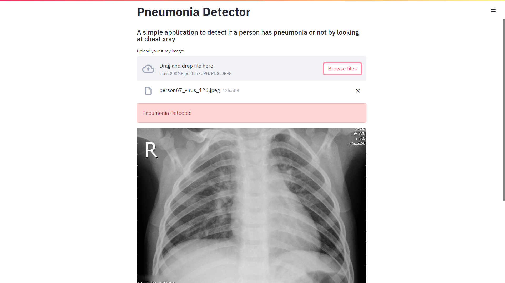

# Pneumonia Detection using Transfer Learning with CNNs

This project serves as a Proof of Concept (POC) for the research work titled "Application of Transfer Learning with CNNs for Pneumonia Detection in Chest X-rays". The research paper can be accessed [here](https://link.springer.com/chapter/10.1007/978-981-16-7136-4_21).

## Abstract

In this study, we propose a deep learning framework based on the Xception architecture, implementing transfer learning. This framework aids both beginners and experts in the medical domain in efficiently examining time-consuming chest X-rays for indications of pneumonia. Pneumonia is a leading infectious disease in the pediatric age group, accounting for nearly 15% of deaths in children each year, totaling almost 2200 deaths per day. Early detection is crucial to prevent fatalities caused by the disease. We trained and fine-tuned our models using transfer learning methods with various reliable architectures, including VGG16, VGG19, Xception, ResNet50V2, InceptionV3, InceptionResNetv2, MobileNet, NASNetMobile, and NASNetLarge, pre-trained on ImageNet. Among these, Xception exhibited the highest performance with a recall of 99.74%, an F1 score of 92.40%, and an AUC of 96.64% on the test set. An initial proof of concept has been deployed for the research community at [detect-pna.piyushbatra.com](http://detect-pna.piyushbatra.com).

## Web Application

The web application allows users to upload a chest X-ray image and determines whether it indicates pneumonia or not.

### Usage

1. Upload a chest X-ray image (formats: jpg, png, jpeg).
2. The application will process the image and provide the result.

### Example



### Running the Application

To run the application, execute `webapp.py`. Ensure all dependencies listed in `requirements.txt` are installed.

```bash
pip install -r requirements.txt
streamlit run webapp.py
```

### Important Note

This POC for pediatric pneumonia detection is a preliminary version. The prediction model deployed on this website may not produce the exact same results as mentioned in the paper due to hardware limitations (lack of GPU and limited memory resources).
